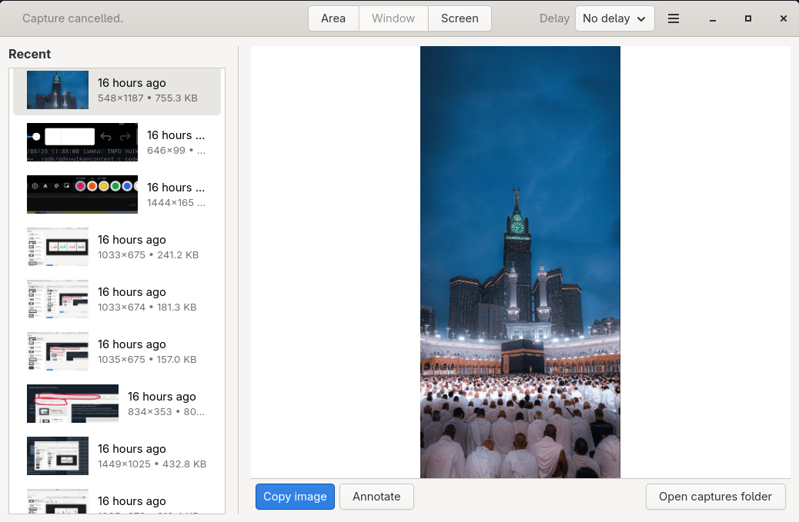
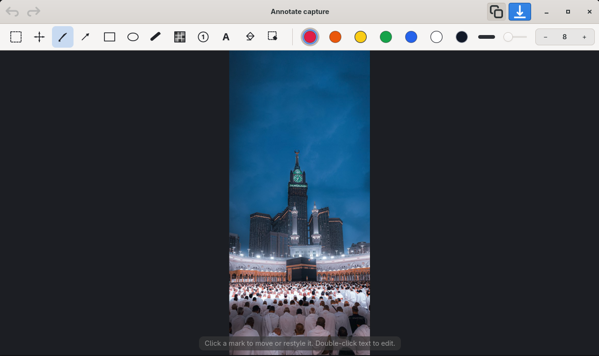
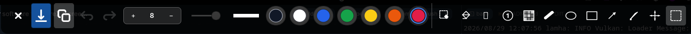
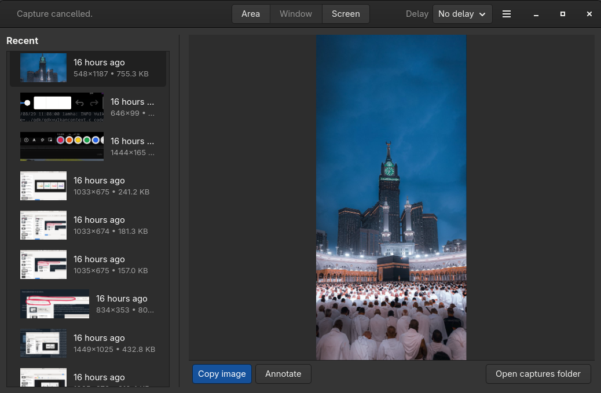
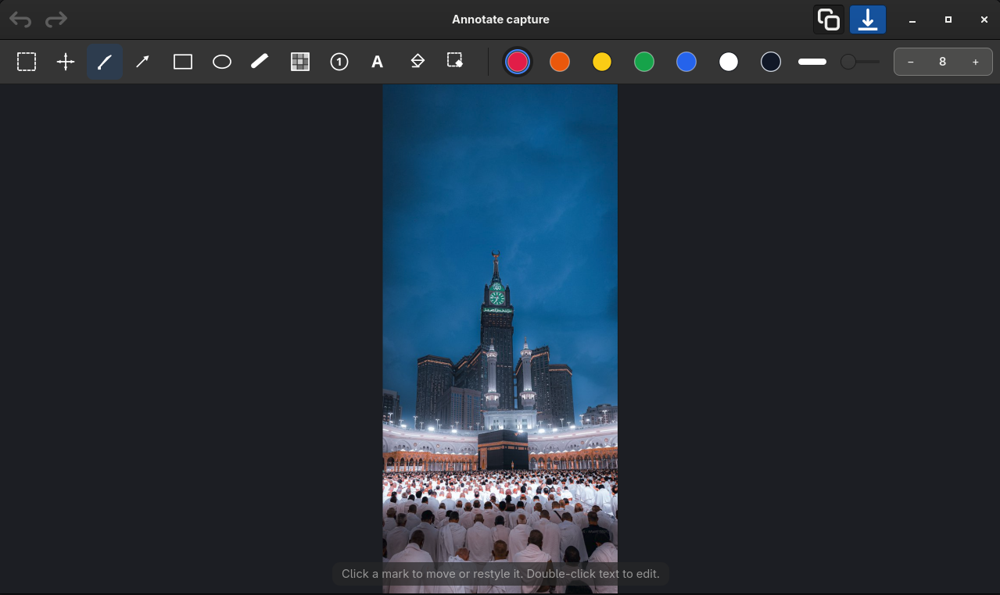

<!-- markdownlint-disable MD033 MD060 -->

<div dir="rtl" lang="ar">

<p align="center">
  
</p>

<h1 align="center">لمحة — Lamha</h1>

<p align="center">
  <strong>جمّد الشاشة. حدّد ما يهم.</strong><br/>
  لقطة صامتة ثم طبقة لمحة للتحديد والتحرير —<br/>
  بلا منتقي جنوم أو كدي.<br/>
  <span dir="ltr">Go · GTK4 · Wayland</span>
</p>

<p align="center">
  <a href="https://github.com/Zyzto/Lamha/releases/latest"></a>
  <a href="https://github.com/Zyzto/Lamha"></a>
  
  
  
  <a href="LICENSE"></a>
</p>

<p align="center">
  <a href="#لقطات">لقطات</a>
  ·
  <a href="#ماذا-تقدّم">ماذا تقدّم؟</a>
  ·
  <a href="#التثبيت">التثبيت</a>
  ·
  <a href="#التطوير">التطوير</a>
  ·
  <a href="#البنية-باختصار">البنية</a>
  <br/>
  <a href="README.md"><span dir="ltr">English</span></a>
</p>

<p align="center">
  الاسم من العربية: <strong>لمحة</strong>
  (<span dir="ltr"><em>lamḥa</em></span>) — نظرة سريعة تلتقط الشاشة.<br/>
  والاسم اللاتيني <span dir="ltr"><strong>Lamha</strong></span> مأخوذ منه.
</p>

</div>

---

<div dir="rtl" lang="ar">

## لقطات

<div dir="ltr">
<p align="center">
  
</p>

<p align="center">
  
</p>

<p align="center">
  
</p>
</div>

<p align="center">
  <sub>الرئيسية · التحرير · شريط الطبقة</sub>
</p>

<details>
<summary>السمة الداكنة</summary>
<div dir="ltr">
<p align="center">
  
</p>
<p align="center">
  
</p>
</div>
<p align="center">
  <sub>الرئيسية · التحرير</sub>
</p>
</details>

</div>

---

<div dir="rtl" lang="ar">

## ماذا تقدّم؟

| | |
|---|---|
| **التقاط صامت** | تجميد الشاشة عبر صدفة جنوم أو كوين أو Spectacle. لا يُفتح منتقي البوابة التفاعلي. |
| **التحديد** | منطقة أو نافذة أو الشاشة كاملة — بعد التجميد، في طبقة لمحة. |
| **التحرير** | قلم، سهم، مستطيل، شكل بيضاوي، تظليل، تمويه، خطوات مرقّمة، نص، محو سحري، محو منطقة. |
| **تحريك وتعديل** | اسحب العلامات، غيّر لونها، تراجع / إعادة، كرّر، احذف. |
| **العدسة** | عدسة دائرية تحت المؤشر. التمرير يغيّر الحجم، والإعدادات تضبط التكبير (2×–10×). |
| **في الخلفية** | أغلق النافذة لإخفائها. التقط من اللوحة أو اختصارات النظام أو `lamha --capture=`. |
| **السجل** | لقطات محلية، معاينة، نسخ، إعادة **التحرير**، ونسخ اختياري عند الحفظ. |
| **اللغات** | العربية (من اليمين لليسار) والإنجليزية. |

**أوضاع الالتقاط**

| الوضع | السلوك |
|--------|--------|
| **منطقة** | تجميد ثم سحب منطقة وتحريرها. |
| **نافذة** | تجميد ثم تحديد مستطيل نافذة. |
| **شاشة** | تجميد الشاشة كلها ثم تحريرها. |

يمكن الانتظار ثانية إلى عشر ثوانٍ حتى تظهر القوائم وحالات التمرير. في المرة الأولى قد يطلب جنوم إذن لقطة الشاشة — وهذا ليس واجهة التقاط جنوم.

تُحفظ اللقطات في `$XDG_DATA_HOME/lamha/captures` (عادةً `~/.local/share/lamha/captures`).

### تقارير الأعطال

تحتفظ لمحة بسجل صغير وتقرير أعطال محليين في `$XDG_STATE_HOME/lamha` (عادةً
`~/.local/state/lamha`). إذا أُغلقت لمحة بشكل غير متوقع، تعرض التقرير عند التشغيل
التالي وتستطيع فتح بلاغ GitHub مُعبّأ مسبقًا. لا تُرفع أي بيانات تلقائيًا؛ راجع
التقرير واحذف التفاصيل الخاصة قبل إرساله.

</div>

---

<div dir="rtl" lang="ar">

## التثبيت

### إصدارات GitHub

البناء الموسوم ينشر ثنائي لينكس وAppImage:

- [أحدث إصدار](https://github.com/Zyzto/Lamha/releases/latest)
- `lamha-YY.0M.MICRO-linux-x86_64` — ثنائي مستقل (يحتاج GTK 4.22+ وGLib 2.86+ على الجهاز)
- `Lamha-YY.0M.MICRO-x86_64.AppImage` — GTK 4 مضمّن؛ يحتاج glibc 2.35+ (أوبونتو 22.04 وفيدورا 36 وديبيان 12 وما بعد)

اجعل الـ AppImage قابلاً للتنفيذ ثم شغّله. يستطيع [AppImageUpdate](https://github.com/AppImage/AppImageUpdate) متابعة `https://github.com/Zyzto/Lamha/releases/latest`. الإصدارات تقويمية مثل الجَنَان: `YY.0M.MICRO` (أول إصدار في أغسطس 2026 هو `26.08.0`). الوسم `v26.08.0`. الرقم في ملف `VERSION`.

### من المصدر

ضع `bin/lamha` في `PATH` ثم:

| الملف | الوجهة |
|------|--------|
| `data/io.github.lamha.Lamha.desktop` | `~/.local/share/applications/` |
| `data/icons/hicolor/scalable/apps/io.github.lamha.Lamha.svg` | `~/.local/share/icons/hicolor/scalable/apps/` |

في جنوم: الإعدادات ← لوحة المفاتيح، أو **الاختصارات** داخل لمحة. في بلازما: إعدادات النظام ← الاختصارات.

### AppImage

يحتاج Go وملفات تطوير GTK4 و`pkg-config` و`curl`:

```bash
make appimage
```

يسحب السكربت [linuxdeploy](https://github.com/linuxdeploy/linuxdeploy) ويكتب الحزمة تحت `dist/`. تجميع GTK4 أوثق على توزيعة FHS عادية (فيدورا، أوبونتو). على NixOS ابنِ الـ AppImage من حاوية أو نظام لينكس آخر إن تعذّر جمع مكتبات المضيف.

</div>

---

<div dir="rtl" lang="ar">

## التطوير

**المتطلبات:** Go `1.26` · GTK4 · `pkg-config`

على NixOS (أو مع Nix):

```bash
nix develop
make run
```

أو ثبّت حزمة تطوير GTK4 و`pkg-config` وGo ثم:

```bash
go run ./cmd/lamha
```

التقاط دون فتح النافذة أولاً (يُمرَّر إلى النسخة العاملة):

```bash
lamha --capture=area
lamha --capture=window
lamha --capture=screen
```

```bash
make test
make build
make fmt
lamha --version
```

لنشر إصدار: حدّث `VERSION` (أو `bash scripts/ci/next_version.sh`) ثم:

```bash
git tag v26.08.0
git push origin v26.08.0
```

Actions تختبر وتبني الثنائي والـ AppImage وترفقهما بإصدار GitHub.

</div>

---

<div dir="rtl" lang="ar">

## البنية باختصار

- **الواجهة** — GTK4 (gotk4)، طبقة والتقاط، عربية عبر `internal/i18n`
- **الالتقاط** — صدفة جنوم ← gnome-screenshot ← كوين ← Spectacle ← بوابة صامتة
- **التحرير** — مستند `internal/annotate` (تراجع، اختبار إصابة، شبكة نقطية)
- **اللوحة** — StatusNotifierItem + DBusMenu
- **الإعدادات والاختصارات** — `~/.config/lamha/`

```text
اللوحة / سطر الأوامر / إجراءات سطح المكتب
        ↓
التقاط صامت (صدفة جنوم / كوين / Spectacle)
        ↓
طبقة لمحة (تحديد + تحرير)
        ↓
معاينة / حافظة / سجل محلي
```

هذه قاعدة التقاط متينة، وليست ادّعاءً لكل ميزات ShareX. الخطوات التالية المفيدة: وجهات الرفع والبحث في السجل.

</div>

---

<div dir="rtl" lang="ar">

## الرخصة

[AGPL-3.0](LICENSE) — استخدم وادرس وعدّل وأعد التوزيع بحرية؛ إن شغّلت نسخة
معدّلة كخدمة على الشبكة، يحق لمستخدميها الحصول على المصدر.

الاسم **لمحة** والكلمة اللاتينية <span dir="ltr">**Lamha**</span> والشعار ليست
مشمولة بتلك الرخصة. انسخ الشيفرة إن شئت، لكن أصدر الفرع باسم وأيقونة مختلفين.

</div>

---

<p align="center">
  من <a href="https://shenepoy.com"><strong>shenepoy</strong></a>
  ·
  <a href="https://github.com/Zyzto">GitHub</a>
</p>
