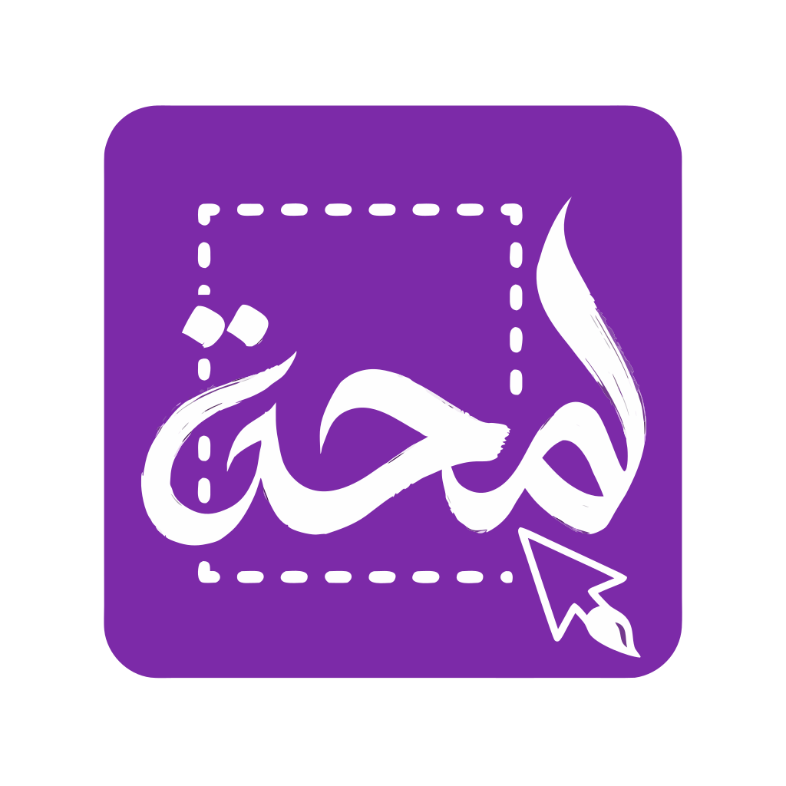

<!-- markdownlint-disable MD033 MD060 -->

<p align="center">
  
</p>

<h1 align="center">Lamha - لمحة</h1>

<p align="center">
  <strong>Freeze the screen. Mark what matters.</strong><br/>
  A silent screenshot, then Lamha’s own overlay for select and markup —<br/>
  no GNOME or KDE picker. Go · GTK4 · Wayland.
</p>

<p align="center">
  <a href="https://github.com/Zyzto/Lamha/releases/latest"></a>
  <a href="https://github.com/Zyzto/Lamha"></a>
  
  
  
  <a href="LICENSE"></a>
</p>

<p align="center">
  <a href="#what-you-get">What you get</a> ·
  <a href="#install">Install</a> ·
  <a href="#develop">Develop</a> ·
  <a href="#architecture-short">Architecture</a> ·
  <a href="README.ar.md">العربية</a>
</p>

<p align="center">
  The name <strong>Lamha</strong> comes from Arabic
  <span dir="rtl"><strong>لمحة</strong></span>
  (<em>lamḥa</em>): a glance / a glimpse —
  catch the screen in one look.
</p>

---

## What you get

| | |
|---|---|
| **Silent grab** | Freezes the display through GNOME Shell, KWin, or Spectacle. The interactive portal picker is never launched. |
| **Select** | Area, window, or full screen — after the freeze, in Lamha’s overlay. |
| **Markup** | Pen, arrow, box, ellipse, highlight, blur, numbered steps, text, magic erase, area erase. |
| **Move & restyle** | Drag marks, restyle them, undo / redo, duplicate, delete. |
| **Lens** | A circular magnifier under the pointer. Scroll changes size; Settings sets zoom (2×–10×). |
| **Stay in back** | Close the window to hide it. Capture from the tray, system shortcuts, or `lamha --capture=`. |
| **History** | Local captures, preview, copy, reopen **Annotate**, optional copy-on-save. |
| **Locales** | English and Arabic (RTL). |

**Capture modes**

| Mode | Behaviour |
|------|-----------|
| **Area** | Freeze, then drag a region and mark it up. |
| **Window** | Freeze, then select a window rectangle. |
| **Screen** | Freeze the whole display and mark it up. |

A delay (1–10 seconds) can wait for menus and hover states. The first time on GNOME, the session may ask for screenshot permission — that is not the GNOME capture UI.

Captures land in `$XDG_DATA_HOME/lamha/captures` (usually `~/.local/share/lamha/captures`).

---

## Install

### From source

Install `bin/lamha` on `PATH`, then:

| File | Destination |
|------|-------------|
| `data/io.github.lamha.Lamha.desktop` | `~/.local/share/applications/` |
| `data/icons/hicolor/scalable/apps/io.github.lamha.Lamha.svg` | `~/.local/share/icons/hicolor/scalable/apps/` |

On GNOME, bind keys in Settings → Keyboard, or open **Shortcuts** in Lamha. Plasma: System Settings → Shortcuts.

### AppImage

Needs Go, GTK4 development files, `pkg-config`, and `curl`:

```bash
make appimage
```

The script pulls [linuxdeploy](https://github.com/linuxdeploy/linuxdeploy) and writes a bundle under `dist/`. GTK4 bundling is most reliable on a regular FHS distro (Fedora, Ubuntu). On NixOS, build the AppImage from a container or another Linux system if linuxdeploy cannot collect host libraries.

---

## Develop

**Requirements:** Go `1.26` · GTK4 · `pkg-config`

On NixOS (or with Nix installed):

```bash
nix develop
make run
```

Otherwise install your distribution’s GTK4 development package, `pkg-config`, and Go, then:

```bash
go run ./cmd/lamha
```

Capture without opening the window first (forwarded to a running instance):

```bash
lamha --capture=area
lamha --capture=window
lamha --capture=screen
```

```bash
make test
make build
make fmt
```

---

## Architecture (short)

- **UI** — GTK4 (gotk4), overlay + editor, Arabic via `internal/i18n`
- **Grab** — GNOME Shell D-Bus → gnome-screenshot → KWin → Spectacle → silent portal
- **Markup** — `internal/annotate` document (undo, hit-test, raster cache)
- **Tray** — StatusNotifierItem + DBusMenu
- **Prefs / keys** — `~/.config/lamha/`

```text
Tray / CLI / desktop actions
        ↓
Silent grab (GNOME Shell / KWin / Spectacle)
        ↓
Lamha overlay (select + markup)
        ↓
preview / clipboard / local history
```

This is a solid capture foundation, not a claim to ShareX’s full set. Useful next steps are upload destinations and history search.

---

## License

[AGPL-3.0](LICENSE) — use, study, modify and redistribute freely; if you run a
modified version as a network service, its users are entitled to your source.

The name **Lamha**, the Arabic wordmark <span dir="rtl">**لمحة**</span>, and the
logo are not covered by that licence. Fork the code, but please ship a fork
under a different name and icon.

---

<p align="center">
  Made by <a href="https://shenepoy.com"><strong>shenepoy</strong></a>
  ·
  <a href="https://github.com/Zyzto">GitHub</a>
</p>
